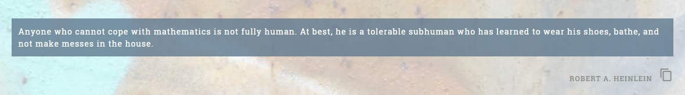

## Simple Copy component for Angular2

#### Short description
This component is designed to work inside your Angular2 application. The component itself imports just Component class from `@angular/core` package. In the sample you can see, that there is also
an import from `@angular2-material/icon`, but it's there just because I build it having a nice `MdIcon` inside. You can use any kind of button, anchor, or your favorite
icon form any icon set (FontAwsome for instance). Just remove the material icon and place whatever you like on its place.

#### Html and TypeScript snippets
This is a snippet from `src/simple/copy.component.ts` (simple way with just standard HTML 5 button element)

````javascript
@Component({
    selector: 'cmp-copy',
    template: `<button class="{{cssClass}}" (click)="copy()">Copy</button>`
})
````

This is a snippet from `src/simple/example.html` (simple way with just standard HTML 5 button element)

````html
<div class="row" *ngFor="let box of boxes">

    <div class="box">
        <div class="col-lg-12">

            <p class="quote">{{box?.Text}}</p>
            <p class="author">{{box?.Author}}
                <cmp-copy [text]="[box?.Text, box?.Author]" [cssClass]="'btn btn-primary'"></cmp-copy>
            </p>

        </div>
    </div>

</div>
````

This is a snippet from `src/with-material/copy.component.ts` (more complex one with material)

````javascript
@Component({
    selector: 'cmp-copy',
    providers: [MdIconRegistry],
    directives: [MdIcon],
    template: `
        <span class="{{cssClass}}" (click)="copy()" >
            <md-icon class="md-24">content_copy</md-icon>
        </span>
        `
})
````
This is a snippet from `src/with-material/example.html` (more complex one with material)
````html
<div class="row" *ngFor="let box of boxes">
    <div class="box">
        <div class="col-lg-12">
            <p class="quote">{{box?.Text}}</p>
            <p class="author">{{box?.Author}}
            <cmp-copy [text]="[box?.Text, box?.Author]" [cssClass]="'copy-quote'"></cmp-copy></p>
        </div>
    </div>
</div>
````

#### Configuration
There are just two parameters to be set on the component in your markup:
* `text` - which in fact is an **array of strings**. This is for the purpose of merging text from several `paragraphs`, `divs` or `spans` into a single
text which you want to have copied to the clipboard. The strings from this array are then joined using a line break separator, thus creating
a multi-line text upon paste
* `cssClass` - string, one or more css classes to be passed into the component, which give you the chance to have some styling on it

Taking a glance a the component you'll notice that it's that simple, that you can make anything that suites you better of it within a few minutes.

#### Prerequisites
I didn't want to put full-blown app here, since I consider this to be useless. The only dependency this directive needs is `@angular/core` (if you don't use `MdIcon` material directive).
So to make this run, you just need to add the component file **copy.component.ts** to your project and reference it in your respective component. Then just set up your mark up - see _Configuration section_

#### Two versions in this repo
There are two versions available in this repository. 
* subdirectory `src/simple` - the simplest possible version with just a button
* subdirectory `src/with-material` - version using @angular2-material `MdIcon` component. For this you need to have `@angular2-material/icon` installed

#### Illustration


The text copied to the clipboard by clicking the Copy icon will consist of the quote and its author separated by line break.

#### Notes
Testes in:
* Google Chrome Verze 50.0.2661.102 m
* FireFox 43.0.1
* MSIE 11
* Edge
* Android
  * Chrome
  * FireFox

